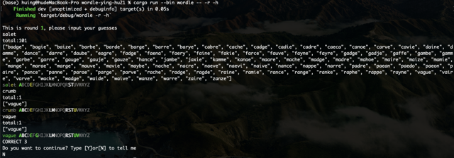
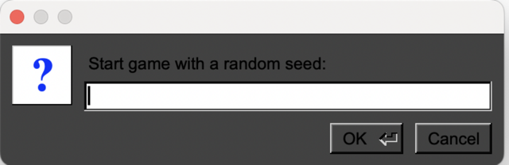
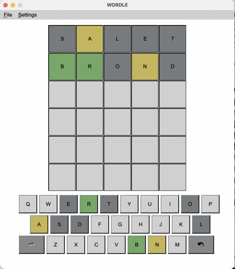

# WORDLE

## 程序结构和说明

+ 程序共能编译得到两个二进制文件，wordle与gui ，二者均使用在 func.rs 中所定义的函数、结构体和枚举类。
+ wordle的主要程序结构为，首先定义一个全局的信息类info，调用 info_analyze函数进行命令行参数的分析，
在这个过程中依次完成配置文件的加载，候选词与可用词库的读入和其他参数的分析，并且将数据存入info中，设定了-word参数时将word_to_guess初始化。
之后进入循环中进行游戏，将word_to_guess和info传入guess_round函数中进行一轮的游戏，针对返回值做出回应，之后询问是否继续。最后保存state。
+ gui 程序中，先进行界面的绘制，定义按钮返回的信息，接着运行app，在收到信息后更新word_to_guess调用calculate_color函数得到匹配的结果，在屏幕上显示。

## 主要功能说明与演示
+ 以各种模式运行wordle，打印结果和颜色：给出剩余可能的候选词
    
+ 以图形界面模式运行，可设定随机种子开始，统计词频率：
    
    